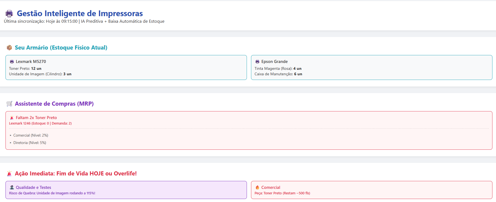
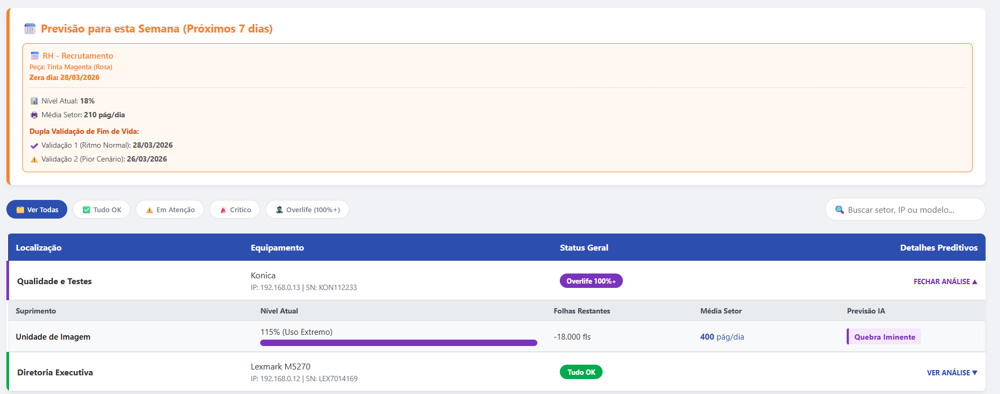
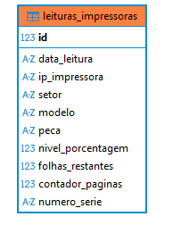

Monitoramento Preditivo de Impressoras (SNMP)

Projeto Full-Stack desenvolvido para automatizar a gestão de um grande parque de impressões corporativo, transformando um processo manual em um **Mini-ERP Preditivo**.

 O Problema e a Solução
Anteriormente, a checagem do nível de toners e peças era reativa (esperava-se a máquina parar para agir). 
Desenvolvi uma solução em Python utilizando **Arquitetura Clean Code / MVC** que varre a rede ativamente via protocolo SNMP, processa os dados em um banco SQLite local, e gera um Dashboard interativo em HTML/JS.

 Principais Funcionalidades (Regras de Negócio)
-  Varredura SNMP Assíncrona: Comunicação UDP direta com o hardware (impressoras Lexmark, Konica, Epson) extraindo OIDs específicos da MIB.
-  IA Preditiva (Cálculo de Consumo): O banco de dados guarda o odômetro diário de cada máquina, calculando a média de páginas impressas por setor e prevendo em quantos dias exatos o toner vai acabar.
-  Motor MRP (Integração de Estoque) O sistema cruza a demanda prevista das máquinas (próximos 15 dias) com o saldo real do almoxarifado físico. Se a conta não fechar, ele gera um alerta automático de compra.
-  Baixa Automática de Estoque: Ao detectar que um toner pulou de 5% para 100%, o Python reconhece a troca física e desconta automaticamente 1 unidade do estoque virtual, salvando o histórico de vida útil da peça.
-  Motor "Overlife" (Uso Extremo):Algoritmo que detecta quando fusores ou cilindros ultrapassam 100% do limite de fábrica, gerando alertas de risco de quebra mecânica.
- Integração com API Telegram: Alertas críticos são enviados em tempo real para o celular da equipe de TI.

 Arquitetura do Projeto (Clean Code)
O projeto foi refatorado aplicando o princípio de Responsabilidade Única (SRP):
* `main.py`: O Controller/Orquestrador do sistema.
* `snmp_service.py`: Lida exclusivamente com a camada de rede e requisições UDP.
* `database_manager.py`: Abstração de persistência de dados (SQLite).
* `dashboard_view.py`: Renderização do Front-End (HTML/CSS/JS).
* `config.py`: Variáveis de ambiente e constantes de rede.

 Tecnologias Utilizadas
* Back-End: Python 3 (asyncio, pysnmp, requests)
* Banco de Dados: SQLite3 (Relacional)
* Front-End: HTML5, CSS3 (Grid/Flexbox), JavaScript Vanilla
* Integrações: API REST Telegram, Protocolo SNMP (UDP porta 161)

## 📷 Demonstração do Dashboard

### Painel Principal (Visão Geral)
### Painel Principal (Visão Geral e Detalhes)

  
  

 

 ### 🗄️ Modelagem do Banco de Dados (SQLite)

  

 

